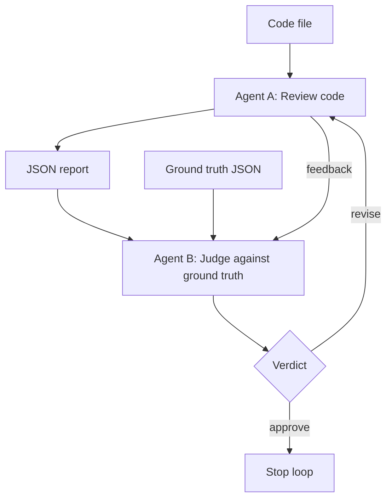

# LLM Agent Reliability

## Project note
Major Commit #1 Notes
 
I identified an inconsistency in my LLM-judge's terminology across runs, root-caused it to an undefined term in the prompt, added an explicit definition, and empirically verified consistency across repeated runs on identical input.

This project explores a multi-agent workflow for evaluating code quality with LLMs. It combines:

- Agent A: a reviewer agent that reads source code and explains what it does, identifies likely bugs, and suggests fixes
- Agent B: a judge agent that compares Agent A's review against a known-good ground truth and decides whether the review should be approved or revised
- a shared JSON helper that strips markdown fences and retries malformed LLM responses
- a loop that sends feedback from Agent B back to Agent A for revision until the review is approved or the max iteration limit is reached

## Goals

The project aims to test whether an LLM-based reviewer can:

- explain the intent of a code snippet
- identify real security, logic, and correctness issues
- suggest practical fixes
- self-assess confidence in its conclusions
- improve itself using judge feedback and ground truth comparison

## Project structure

- `core/AgentA.py` — code review agent
- `core/AgentB.py` - judge agent
- `core/llm_json.py` — shared JSON parsing and retry helper
- `core/main.py` — orchestration loop
- `ground_truth.json` — expected review data for benchmarking
- `snippets/scraper_001.js` — sample code used for evaluation
- `.env` — local environment secrets, such as the Anthropic API key

## High-level architecture



## How the loop works

1. Load the source code and ground-truth data.
2. Run Agent A on the code.
3. Agent B compares Agent A's output against the ground truth.
4. If Agent B says `approve`, the loop stops.
5. If Agent B says `revise`, the feedback is passed back to Agent A and the review is retried.
6. The loop stops at a max iteration count to prevent infinite retries.

## Agent A

Agent A is responsible for reading and analyzing code.

It does the following:

- accepts source code as input
- builds a prompt for Claude
- asks for:
  - a summary of what the code does
  - likely bugs or risky behavior
  - suggested fixes
  - a confidence score from 1 to 10
- returns structured JSON instead of free-form text
- optionally accepts judge feedback to revise a previous review

## Agent B

Agent B acts as the judge.

It compares Agent A's output to the expected results in `ground_truth.json` and returns:

- `correctness_score`
- `completeness_score`
- `verdict` (`approve` or `revise`)
- `feedback` explaining what was correct, missing, or wrong

## Shared helper: `core/llm_json.py`

This file prevents common LLM output issues:

- strips markdown fences like ```json ... ```
- tries to parse JSON safely
- retries failed responses up to a limit
- returns a clear error object when parsing fails repeatedly

This makes both agents more resilient when the model returns malformed output.

## Local setup

1. Create a virtual environment.
2. Install the required Python packages.
3. Add your Anthropic API key to `.env`:

```env
ANTHROPIC_API_KEY=your_key_here
```

4. Run the loop:

```bash
python core/main.py
```

## Example run

```bash
python core/main.py
```

The program prints iteration details and ultimately returns a final result with a `status` field such as:

- `approved`
- `max_iterations_reached`

## Known limitation: feedback-induced fabrication

### Observed behavior

When Agent B's feedback names a specific issue that Agent A missed, Agent A may fail to verify that claim against the source code. In testing, a fictional Unicode-normalization bug was planted in the ground truth. Agent A then produced a detailed, plausible bug report and suggested fix for an issue that was not present in the code.

### Attempted mitigation and result

Agent A's prompt was updated to tell it to verify feedback against the code before including a claim and to say when it cannot verify one. This was insufficient: Agent A produced verification-shaped language (for example, claiming that the function performed no normalization) without establishing that the supposed issue was actually a bug. The absence of a feature was treated as evidence of a defect.

### Root cause

An LLM can follow the surface form of an instruction—such as writing text that sounds like verification—without reliably performing the intended evidence-based reasoning. Prompt-level self-verification is therefore not a dependable guardrail against feedback-induced fabrication.

### Possible stronger mitigations (not implemented; out of scope for v1)

- Strip specific bug descriptions from Agent B's feedback so Agent A must re-analyze the code independently. This may reduce anchoring but also makes legitimate missed issues harder to guide Agent A toward.
- Require line-level source citations for each claimed bug and verify those citations programmatically against the actual source. This would add an external check that does not rely on the model's own assertion that it verified a claim.

## Commit history and functionality

This timeline uses the commit subjects, dates, and abbreviated hashes from this repository's Git history.

| Date | Commit | Functionality |
| --- | --- | --- |
| 2026-09-21 | `7280a06` — `Basic framework` | Created the initial README. |
| 2026-09-21 | `0265af4` — `Basic framework` | Added the initial Agent A and Agent B implementations, JSON helper, source examples, ground truth, and `.gitignore`. |
| 2026-09-22 | `e4c08ab` — `Added multi-agent code review pipeline with judge loop` | Added the first orchestration loop and scraper snippet; Agent A was adjusted to accept judge feedback. |
| 2026-09-23 | `1631e1e` — `Major Commit #1 refer to the README.md` | Reorganized the project into `core/` and `initial_testing/`, added the shared JSON helper and review loop under `core/`, and added a revision test. |
| 2026-09-27 | `a4df96e` — `Added Snippet #2` | Updated the core runner and agent integration for the second evaluation snippet. |
| 2026-09-27 | `d589480` — `Added Snippet #2` | Added `split_001.py` and its ground-truth entry. |
| 2026-09-27 | `0385cab` — `tested api_error handling` | Improved shared LLM JSON/API error handling and added an API-error test. |

### `Add feedback verification and stalled-loop detection`

On 2026-09-29, Agent A's prompt was updated to require checking judge feedback against the source code before incorporating it. The review loop was also updated to detect when judge scores stopped improving, and `ground_truth_test_stall.json` was added to exercise that behavior.

## Notes

This project is a prototype for an LLM-based reliability workflow. The design intentionally keeps Agent A and Agent B separate so the evaluation process can be measured and improved over time.

The overall goal is not just to generate guesses, but to compare model-generated analysis against a known-good benchmark and iterate on the result.
