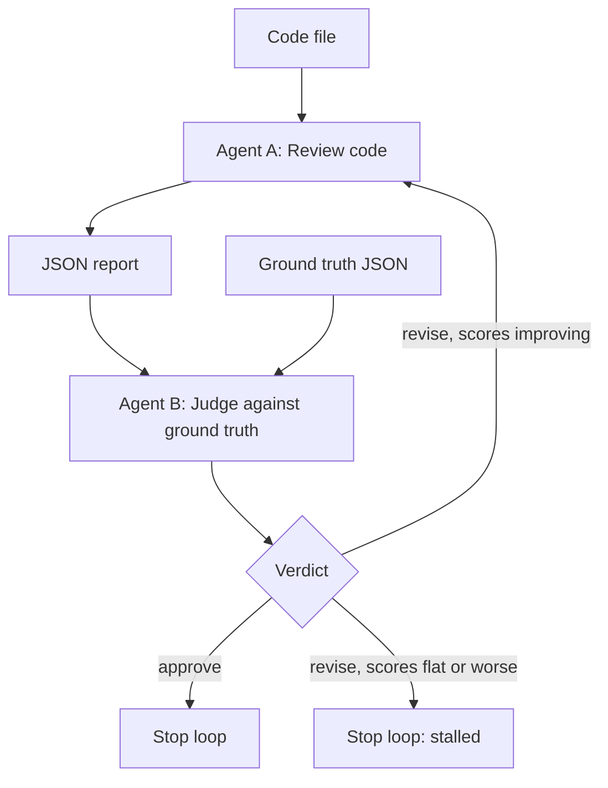

# LLM Agent Reliability

This project explores a multi-agent workflow for evaluating code quality with LLMs. It combines:

- Agent A: a reviewer agent that reads source code and explains what it does, identifies likely bugs, and suggests fixes
- Agent B: a judge agent that compares Agent A's review against a known-good ground truth and decides whether the review should be approved or revised
- a shared JSON helper that strips markdown fences, retries malformed LLM responses, and retries transient API-level errors
- a loop that sends feedback from Agent B back to Agent A for revision until the review is approved, a stall is detected, or the max iteration limit is reached

## Goals

The project aims to test whether an LLM-based reviewer can:

- explain the intent of a code snippet
- identify real security, logic, and correctness issues
- suggest practical fixes
- self-assess confidence in its conclusions
- improve itself using judge feedback and ground truth comparison

## Project structure

- `core/AgentA.py` — code review agent
- `core/AgentB.py` — judge agent
- `core/llm_json.py` — shared JSON parsing, markdown-fence stripping, and retry helper (handles both malformed output and transient API errors)
- `core/main.py` — orchestration loop, including stalled-loop detection
- `ground_truth.json` — expected review data for benchmarking, one entry per snippet
- `ground_truth_test_stall.json` — test-only ground truth containing a deliberately fictional bug, used to exercise stall detection and feedback-fabrication testing
- `snippets/scraper_001.js` — sample code used for evaluation (Express/Node.js API wrapper with 5 known bugs)
- `snippets/split_001.py` — sample code used for evaluation (Python string-split function with 1-2 known bugs, depending on ground truth file used)
- `.env` — local environment secrets, such as the Anthropic API key

## High-level architecture



## How the loop works

1. Load the source code and ground-truth data.
2. Run Agent A on the code.
3. Agent B compares Agent A's output against the ground truth.
4. If Agent B says `approve`, the loop stops.
5. If Agent B says `revise`, the feedback is passed back to Agent A and the review is retried — unless Agent B's scores have not improved over the previous iteration, in which case the loop stops early as `stalled`.
6. The loop stops at a max iteration count to prevent infinite retries.

## Agent A

Agent A is responsible for reading and analyzing code.

It does the following:

- accepts source code as input
- builds a prompt for Claude
- asks for:
  - a summary of what the code does
  - likely bugs or risky behavior
  - suggested fixes
  - a confidence score from 1 to 10
- returns structured JSON instead of free-form text
- optionally accepts judge feedback to revise a previous review, with an explicit instruction to verify feedback against the actual code rather than assume it is correct (see Known Limitation below for why this instruction is only a partial mitigation)

## Agent B

Agent B acts as the judge.

It compares Agent A's output to the expected results in `ground_truth.json` and returns:

- `correctness_score`
- `completeness_score`
- `verdict` (`approve` or `revise`)
- `feedback` explaining what was correct, missing, or wrong — using explicit definitions for "false positive" (factually wrong or unsupported by the code) versus "additional finding" (accurate but outside the ground-truth scope), to keep this distinction consistent across runs

## Shared helper: `core/llm_json.py`

This file prevents common LLM and API reliability issues:

- strips markdown fences like ```json ... ```
- tries to parse JSON safely
- retries failed responses up to a limit
- separately catches and retries API-level errors (connection errors, rate limits, timeouts, server errors) with a short delay between attempts
- returns a clear, structured error object — distinguishing a raw-output parsing failure from an API-level failure — when retries are exhausted

This makes both agents more resilient to malformed model output and transient infrastructure failures, and keeps the two failure classes distinguishable in the output rather than collapsed into one generic error.

## Evaluation methodology and key design decisions

### Why ground-truth grading, not just an LLM rubric
An LLM judge grading purely on its own reasoning ("does this look right?") is a soft, unverified signal — it can be gamed by confident-sounding but wrong analysis, or drift in what it considers acceptable over time. Agent B grades against a fixed, human-written ground truth for each snippet instead, giving correctness and completeness an actual reference point rather than relying on the judge's unverified opinion alone.

### Why Agent A returns multiple bugs, not one
An earlier design had Agent A return a single `identified_bug`/`fix` pair. This was changed to a `bugs: [...]` list because the completeness metric — "did the reviewer catch everything, not just one thing" — is meaningless against a single-bug schema. A list allows completeness to actually vary and be gradable.

### False positive vs. additional finding
Early testing showed Agent B inconsistently labeling accurate-but-out-of-scope findings (e.g. a valid security observation not in the ground truth) as "false positives" across different runs on identical input — sometimes calling the same category of finding a false positive, sometimes not. The term was undefined in the prompt, so the model's interpretation drifted from run to run. Adding explicit definitions to the prompt — false positive = factually wrong or unsupported by the code; additional finding = accurate but outside the ground-truth scope — was tested across 3 repeated runs on identical input and confirmed to produce consistent labeling afterward.

### Separating technical failures from content failures
Malformed or truncated LLM output and API-level errors (rate limits, connection errors, timeouts) are retried directly at the call level (`llm_json.py`), without consuming an iteration of the approve/revise loop or ever reaching Agent B for grading. Only genuine content disagreements (Agent A's analysis is incomplete or wrong, per Agent B) go through the revise cycle. This keeps the iteration count meaningful — it reflects actual review-quality attempts, not infrastructure retries — and keeps failure logs distinguishable (a run that failed 3 times on API errors looks nothing like a run that genuinely couldn't produce a correct review).

### Stall detection
Rather than comparing Agent A's raw text output across iterations (unreliable, since LLM phrasing varies even when content is stable), the loop tracks Agent B's `correctness_score` and `completeness_score` across iterations. If neither score improves between two consecutive `revise` verdicts, the loop exits early as `stalled` rather than burning the remaining iteration budget. This is a proxy signal, not a direct comparison of Agent A's actual output — a documented simplification made for cost and implementation-complexity reasons, not a claim that it is the most precise possible approach.

## Local setup

1. Create a virtual environment.
2. Install the required Python packages.
3. Add your Anthropic API key to `.env`:

```env
ANTHROPIC_API_KEY=your_key_here
```

4. Run the loop:

```bash
python core/main.py
```

## Example run

```bash
python core/main.py
```

The program prints iteration details and ultimately returns a final result with a `status` field, one of:

- `approved` — Agent B issued an `approve` verdict
- `max_iterations_reached` — the loop hit its iteration cap without approval
- `stalled` — Agent B's scores stopped improving across consecutive `revise` verdicts, and the loop exited early

## Known limitation: feedback-induced fabrication

### Observed behavior

When Agent B's feedback names a specific issue that Agent A missed, Agent A may fail to verify that claim against the source code. In testing, a fictional Unicode-normalization bug was planted in the ground truth (`ground_truth_test_stall.json`). Agent A then produced a detailed, plausible bug report and suggested fix for an issue that was not present in the code — including a fabricated code snippet using `unicodedata.normalize`.

### Attempted mitigation and result

Agent A's prompt was updated to tell it to verify feedback against the code before including a claim, and to state explicitly when it cannot verify one. This was insufficient: Agent A produced verification-shaped language (for example, claiming "the function performs no normalization" as "evidence" of a bug) without establishing that the supposed issue was actually a defect. The absence of a feature was misrepresented as evidence that the feature's absence constituted a bug.

### Root cause

An LLM can follow the surface form of an instruction — such as writing text that sounds like verification — without reliably performing the intended evidence-based reasoning. Prompt-level self-verification is therefore not a dependable guardrail against feedback-induced fabrication on its own.

### Possible stronger mitigations (not implemented; out of scope for v1)

- Strip specific bug descriptions from Agent B's feedback so Agent A must re-analyze the code independently, rather than being told what is supposedly missing. This may reduce anchoring but also makes legitimate missed issues harder to guide Agent A toward, since feedback becomes less actionable.
- Require line-level source citations for each claimed bug and verify those citations programmatically against the actual source file. This would add an external, model-independent check rather than relying on the model's own assertion that it verified a claim.

## Commit history and functionality

This timeline uses the commit subjects, dates, and abbreviated hashes from this repository's Git history.

| Date | Commit | Functionality |
| --- | --- | --- |
| 2026-09-21 | `7280a06` — `Basic framework` | Created the initial README. |
| 2026-09-21 | `0265af4` — `Basic framework` | Added the initial Agent A and Agent B implementations, JSON helper, source examples, ground truth, and `.gitignore`. |
| 2026-09-22 | `e4c08ab` — `Added multi-agent code review pipeline with judge loop` | Added the first orchestration loop and scraper snippet; Agent A was adjusted to accept judge feedback. |
| 2026-09-23 | `1631e1e` — `Major Commit #1 refer to the README.md` | Reorganized the project into `core/` and `initial_testing/`, added the shared JSON helper and review loop under `core/`, and added a revision test. Also identified and fixed an inconsistency in Agent B's "false positive" terminology across runs, root-caused to an undefined term in the prompt; verified the fix produced consistent labeling across repeated runs on identical input. |
| 2026-09-27 | `a4df96e` — `Added Snippet #2` | Updated the core runner and agent integration for the second evaluation snippet. |
| 2026-09-27 | `d589480` — `Added Snippet #2` | Added `split_001.py` and its ground-truth entry. |
| 2026-09-27 | `0385cab` — `tested api_error handling` | Improved shared LLM JSON/API error handling and added an API-error test. |
| 2026-09-29 | `Add feedback verification and stalled-loop detection` | Updated Agent A's prompt to require checking judge feedback against the source code before incorporating it. Updated the review loop to detect when judge scores stop improving across iterations. Added `ground_truth_test_stall.json` to exercise stall detection, which also surfaced the feedback-induced fabrication limitation documented above. |

## Notes

This project is a prototype for an LLM-based reliability workflow. The design intentionally keeps Agent A and Agent B separate so the evaluation process can be measured and improved over time.

The overall goal is not just to generate guesses, but to compare model-generated analysis against a known-good benchmark and iterate on the result.